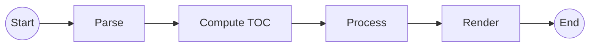

# Diagrams

The [default theme](default-theme.md) can embed [Mermaid](http://knsv.github.io/mermaid/) to render diagrams. It recognizes fenced code blocks whose info string starts with the language code `mermaid` and treats them specially instead of calling the standard [highlighter](highlighting.md).

> {.note}
> Note that diagrams are rendered on the client side with JavaScript. The generated site contains the source code for the diagrams.

Example:

````markdown

````

This is rendered as:


