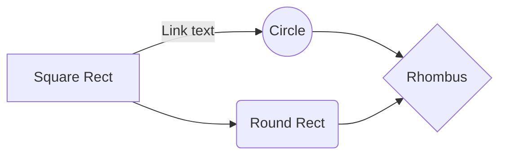
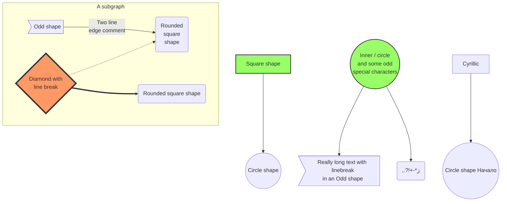
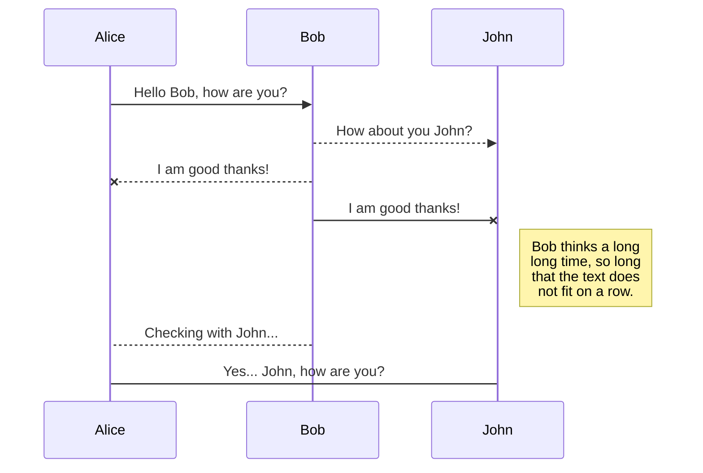
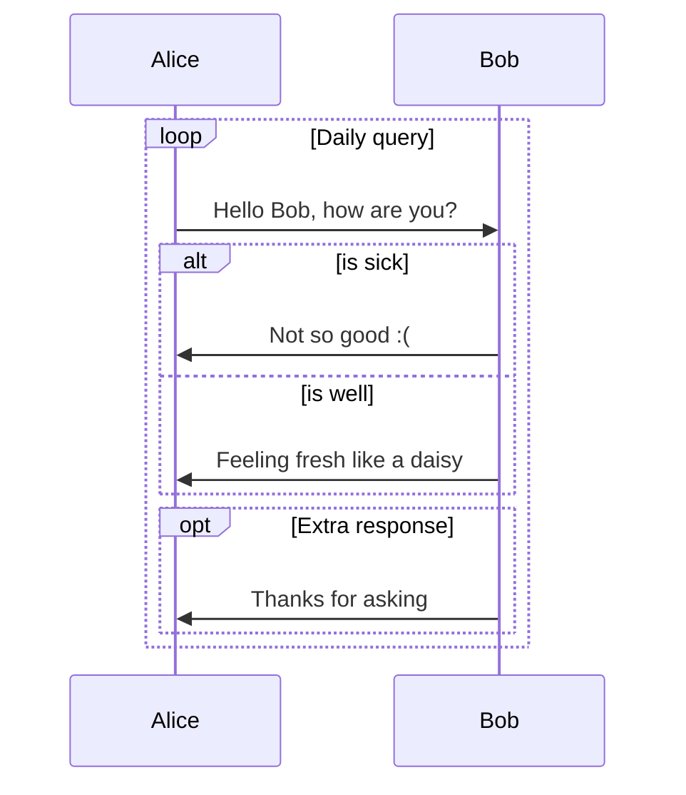
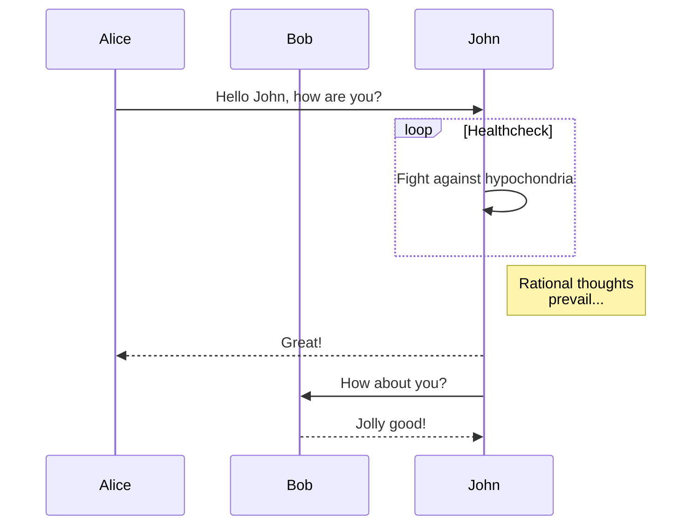
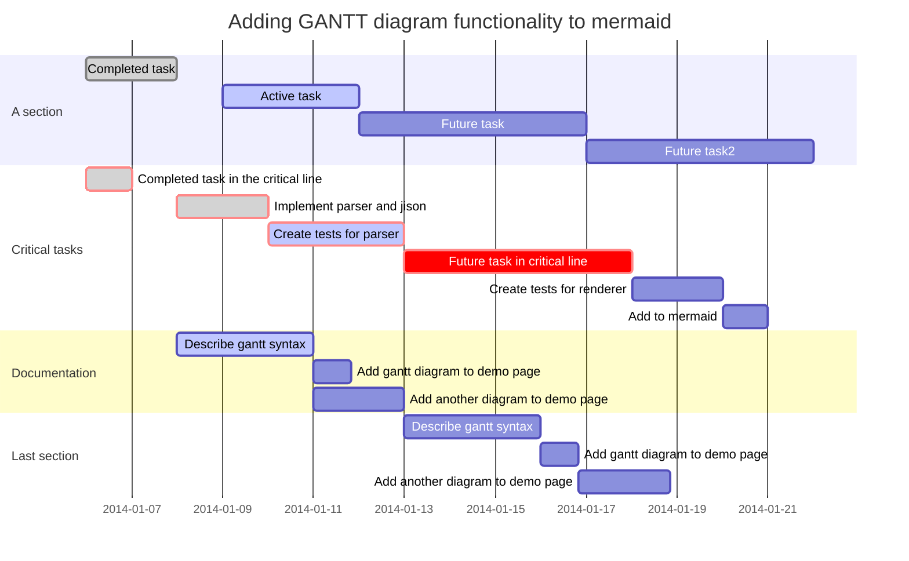

---
highlight.highlightjs.fenced = null
highlight.highlightjs.indented = scala
highlight.highlightjs.inline = scala
---
# All Elements

This page shows all basic elements that can be rendered from Markdown (with the standard extensions). It can be used to test themes.

## Plain Text Paragraphs

*The first two paragraphs consist of a single line of source text:*

Lorem ipsum dolor sit amet, consectetur adipiscing elit. Donec erat sem, ultrices ac rhoncus ut, pharetra sed velit. Quisque eu est sed nisl porta placerat et tempor mi. Aenean porta turpis sed erat vestibulum blandit. Morbi dapibus eros enim, non dignissim augue posuere ac. Etiam facilisis mauris tempus euismod imperdiet. Ut ultricies libero tellus, in porttitor lorem tincidunt in. Praesent nulla lectus, consectetur ac bibendum eu, consectetur nec massa.

Donec ut libero quis mi vehicula elementum. Praesent molestie dictum erat, eu bibendum arcu congue eu. Pellentesque aliquet condimentum mi a pretium. Phasellus mi magna, luctus ut vestibulum et, lobortis et erat. Maecenas nec blandit neque, at ultrices orci. Nunc venenatis, arcu ut varius posuere, elit libero euismod mauris, vitae convallis tellus mauris et felis. Mauris elit enim, porttitor eu augue ac, fringilla aliquam nulla.

*The following paragraph uses soft line breaks:*

Pellentesque fringilla mi non urna congue scelerisque. Nam id congue justo, vel elementum purus. Cras interdum
convallis dolor, sagittis pellentesque erat imperdiet vitae. Ut iaculis feugiat orci eu varius. Vivamus quis
elementum turpis. Donec vitae neque in nibh euismod tincidunt ullamcorper in enim. Curabitur arcu risus, lacinia
sed efficitur ac, dignissim in neque. Nulla imperdiet rhoncus fermentum. Donec porttitor rutrum sem, non dapibus
felis elementum non. Sed bibendum volutpat nisl, a ultrices nulla volutpat nec. Integer imperdiet, leo id vestibulum
rutrum, nibh lectus tincidunt velit, iaculis commodo quam augue non urna. Pellentesque venenatis libero nulla, in
euismod ligula egestas sit amet. Suspendisse congue orci neque.

## Inline Elements

Text can contain code like `val x = 42` (using Scala highlighting on this page). It can be used without adjacent spaces, e.g.: `x`'s value is larger than `y`'s value. HTML 5 entities like &prod; and &radic; and other Unicode characters may be used in text.

Text can contain *emphasis* and **strong emphasis**. Intra**word**emphasis _and**mixed**emphasis_ are also supported. If the `strikethrough` extension is enabled, ~~it looks like this~~.

Simple [links](index.md) consist of a link target and text. The text may [**contain** ~~other~~ _markup_](index.md). Links can also have [titles](index.md "Here's the title"). Plain links (either enclosed in angle brackets or created by the `autolink` extension) look like <http://lightbend.com> which consist of the URL as link text and target, and no title.

Here's an image from highlight.js in its own paragraph:


And here is the same image  used in an inline context.

Here is a paragraph with embedded emojis: Lorem ipsum dolor sit amet :thumbsup:, consectetur adipiscing elit. Donec erat sem, ultrices ac rhoncus ut, pharetra sed velit. Quisque eu est sed nisl porta placerat et tempor mi. Aenean porta turpis sed :thumbsdown: erat vestibulum blandit. Morbi dapibus eros enim, non dignissim augue posuere ac. Etiam facilisis mauris tempus euismod imperdiet. Ut ultricies libero tellus, in porttitor lorem tincidunt in. Praesent nulla lectus, consectetur ac bibendum eu, consectetur nec massa.

## Math

Here is a math block that gets rendered with MathJax:

```texmath
\begin{array}{lcll}
\{a, A\} \;\vec{+}\; B &=& a, (A \;\vec{+}\; B)  &{\bf if} \; a \not\in B \\\\
                       &=& A \;\vec{+}\; B       &{\bf if} \; a \in B
\end{array}
```

A paragraph following the math block.

## Code Blocks

Here's some Scala code:

```scala
class AttributedHeading extends Heading {
  var id: String = null
  val attrs: ListBuffer[String] = new ListBuffer

  override protected def toStringAttributes = {
    val b = new StringBuilder().append(s"level=$getLevel")
    if(id ne null) b.append(" id="+id)
    if(attrs.nonEmpty) b.append(attrs.mkString(" attrs=[", ", ", "]"))
    b.toString
  }
}
```

Multiple code blocks can be combined in a tabbed view:

```scala tab=Scala
class AttributedHeading extends Heading {
  var id: String = null
  val attrs: ListBuffer[String] = new ListBuffer

  override protected def toStringAttributes = {
    val b = new StringBuilder().append(s"level=$getLevel")
    if(id ne null) b.append(" id="+id)
    if(attrs.nonEmpty) b.append(attrs.mkString(" attrs=[", ", ", "]"))
    b.toString
  }
}
```

```java tab=Java
public class AttributedHeading extends Heading {
  // Insert lots of boilerplate here
}
```

Using the `includeCode` extension, code blocks can also come from included files:

```xml src=../../core/src/main/resources/logback.xml
```

...or parts of included files:

```scala src=../../core/src/main/scala/com/novocode/ornate/Main.scala#main
  Snippet Placeholder -- only rendered when snippet processing fails
```

## Block Quotes

This is a block quote:

> Etiam efficitur porta nulla, vel cursus nibh rhoncus vel. Class aptent taciti sociosqu ad litora torquent per conubia nostra, per inceptos himenaeos. Proin leo massa, malesuada ut feugiat ac, venenatis id felis.

And here are two adjacent block quotes:

> Maecenas luctus tristique imperdiet. Cras imperdiet mi ornare odio iaculis pulvinar. Maecenas metus dolor, porttitor sed vestibulum vitae, faucibus id velit. Aliquam eget lorem tellus. Maecenas lacinia mollis leo, ac condimentum leo accumsan sollicitudin. Phasellus sed nulla at turpis ornare malesuada.

> Curabitur imperdiet ante at velit elementum, sit amet gravida ipsum imperdiet. Duis tortor tortor, venenatis sit amet laoreet et, vulputate sed nisi. Aliquam id finibus libero. Etiam finibus molestie tristique. Maecenas ultricies diam et risus pharetra, eu pharetra lorem mattis. Sed non ipsum sit amet felis dignissim convallis.

This is a single block quote consisting of two paragraphs:

> Curabitur et elit mauris. Ut sodales pellentesque consectetur. Etiam dapibus leo vel eros facilisis, et dapibus lectus lobortis.
>
> Pellentesque ac tempor magna. Mauris bibendum ullamcorper pretium. Pellentesque vestibulum nulla urna, eget scelerisque tortor suscipit sit amet. Ut tempor velit at nibh porta, in feugiat turpis aliquet.

Block quotes may be nested:

> Integer cursus nibh massa, quis rutrum quam dapibus in. Nunc neque lacus, mollis a sapien vitae, facilisis vulputate neque. Etiam bibendum suscipit lectus, ut eleifend metus hendrerit sit amet. Nam non metus nulla. Etiam dictum eleifend eros.
>> Quisque commodo sapien nec porta consequat. Nam eu pharetra risus. Aliquam scelerisque, urna at finibus accumsan, nisl elit pulvinar ante, at pellentesque nisi est sit amet urna.
>
> Nulla nulla arcu, aliquet gravida ligula sed, porttitor imperdiet elit. Fusce accumsan mi ipsum, in malesuada orci porta vitae.

They may contain other block-level or inline content like code blocks:

> Here is a nested code block:
>
> ```scala
>   class AttributedHeading extends Heading {
>     var id: String = null
>     val attrs: ListBuffer[String] = new ListBuffer
>
>     override protected def toStringAttributes = {
>       val b = new StringBuilder().append(s"level=$getLevel")
>       if(id ne null) b.append(" id="+id)
>       if(attrs.nonEmpty) b.append(attrs.mkString(" attrs=[", ", ", "]"))
>       b.toString
>     }
>   }
> ```
>
> And some `nested inline code` in a text paragraph.

If the `blockQuoteAttributes` extension is enabled, quote classes *note* and *warning* are available:

> {.note}
> This is a note.

> {.warning}
> This is a warning.

## Lines

This is a horizontal line:

* * *

And here's the following paragraph.

## Lists

This is a tight bullet list:

- List item; the following item is empty
-
- List item
  - Nested list item
    - 2nd level nested list item
      - 3rd level nested list item
        - 4th level nested list item
          - 5th level nested list item
    - 2nd level nested list item
    - 2nd level nested list item
  - Nested list item
  - Nested list item
    - 2nd level nested list item
- List item

This is a tight ordered list containing bullet lists for level 2 and below:

1. List item; the following item is empty
1.
1. List item
   1. Nested list item
      - 2nd level nested list item
        - 3rd level nested list item
          - 4th level nested list item
            - 5th level nested list item
      - 2nd level nested list item
      - 2nd level nested list item
   1. Nested list item
   1. Nested list item
      - 2nd level nested list item
1. List item

This is a loose bullet list:

- Vestibulum dui dui, porttitor id ultricies a, finibus eget elit. Suspendisse pharetra arcu leo, ut consequat leo ultricies sed.

  Donec iaculis metus in metus posuere faucibus. Phasellus vehicula nisi vitae scelerisque iaculis.

  Morbi hendrerit lectus consectetur odio efficitur condimentum. Suspendisse in placerat diam. Donec facilisis nibh ut porta ultricies.

- Lists can contain other block content like code blocks:

  ```scala
    class AttributedHeading extends Heading {
      ...
    }
  ```

- Nam eget iaculis augue. Maecenas nisl lorem, sollicitudin quis leo quis, malesuada mollis massa. Nam ac lacus arcu. Donec condimentum velit turpis, vitae posuere arcu volutpat vel. Morbi a metus et ante tincidunt vestibulum. Integer tincidunt velit ipsum, et vestibulum sapien molestie a. Mauris molestie tincidunt erat, a ornare elit pharetra ac. Nulla congue lacus purus, sit amet vehicula lacus scelerisque in. Integer ut interdum augue. Sed hendrerit mauris eget libero vestibulum, sed dignissim dui dictum. Nunc tincidunt commodo lorem id sollicitudin.

## Tables

Tables created by the `tables` extension are based on [GitHub Flavored Markdown](https://help.github.com/articles/organizing-information-with-tables/). The following examples were taken from this page. Here is a simple table:

| First Header  | Second Header |
| ------------- | ------------- |
| Content Cell  | Content Cell  |
| Content Cell  | Content Cell  |

Table cells can contain formatting:

| Command | Description |
| --- | --- |
| `git status` | List all *new or modified* files |
| `git diff` | Show file differences that **haven't been** staged |

Columns may be left, center or right aligned:

| Left-aligned | Center-aligned | Right-aligned |
| :---         |     :---:      |          ---: |
| git status   | git status     | git status    |
| git diff     | git diff       | git diff      |

Here is a wide table:

| First Header  | Second Header | First Header  | Second Header | First Header  | Second Header | First Header  | Second Header | First Header  | Second Header |
| ------------- | ------------- | ------------- | ------------- | ------------- | ------------- | ------------- | ------------- | ------------- | ------------- |
| Content_Cell  | Content_Cell  | Content_Cell  | Content_Cell  | Content_Cell  | Content_Cell  | Content_Cell  | Content_Cell  | Content_Cell  | Content_Cell  |
| Content_Cell  | Content_Cell  | Content_Cell  | Content_Cell  | Content_Cell  | Content_Cell  | Content_Cell  | Content_Cell  | Content_Cell  | Content_Cell  |

## Diagrams

The following diagrams were taken directly from the [Mermaid documentation](http://knsv.github.io/mermaid/index.html#demos). They show the different kinds of diagrams that can be created:

### Basic Flowchart



### Larger Flowchart With Some Styling



### Basic Sequence Diagram



### Loops, Alt And Opt



### Message To Self In Loop



### Gantt Chart



## TOC Trees

This is the full site TOC:


## Section Titles

The title above is at level H2, the topmost page title is at level H1. Here are the other available levels H3 to H6:

### H3 Title

Paragraph of text.

#### H4 Title

Paragraph of text.

##### H5 Title

Paragraph of text.

###### H6 Title

Paragraph of text.
